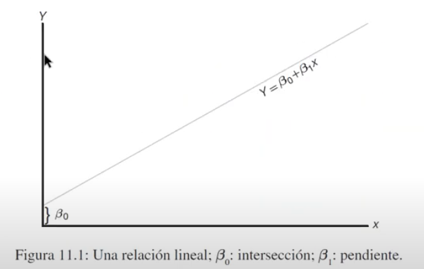
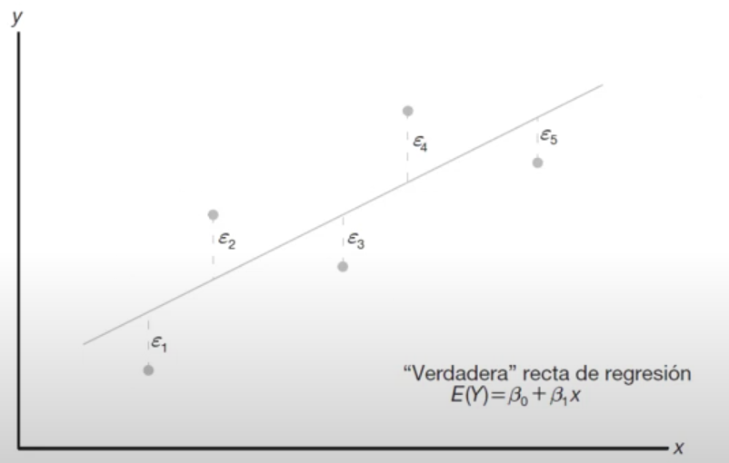
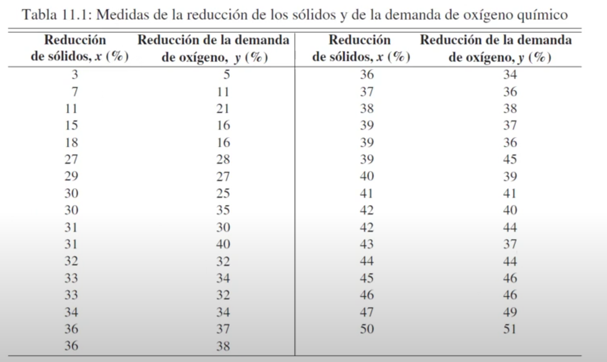
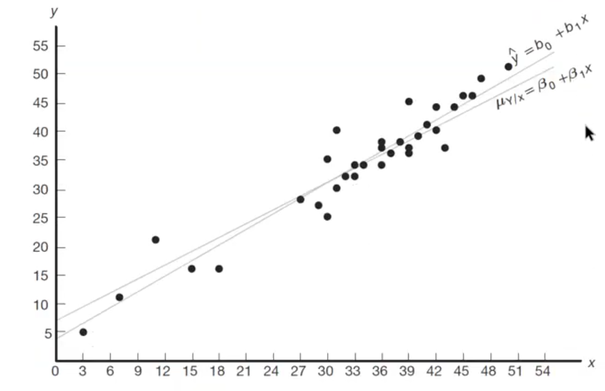
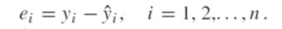
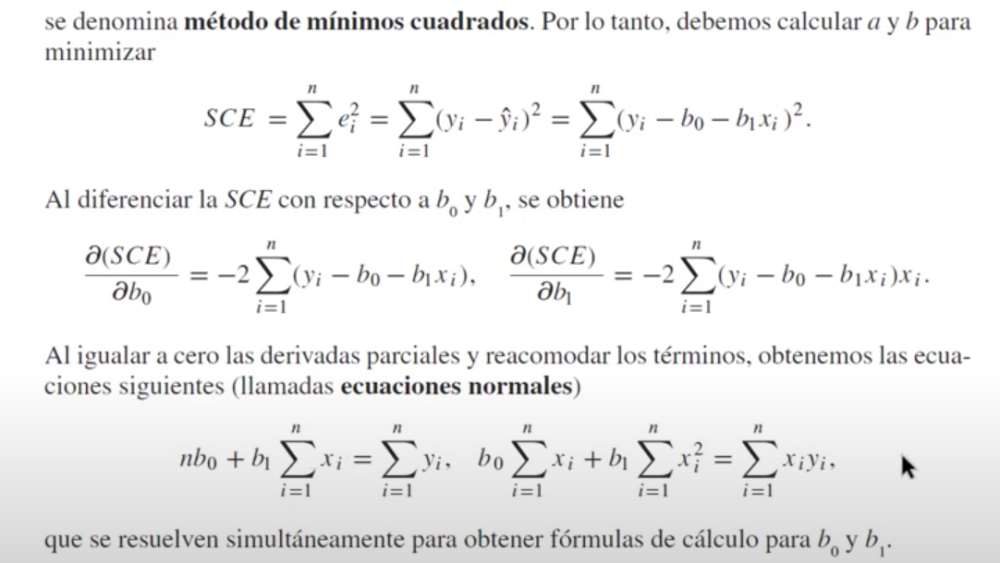
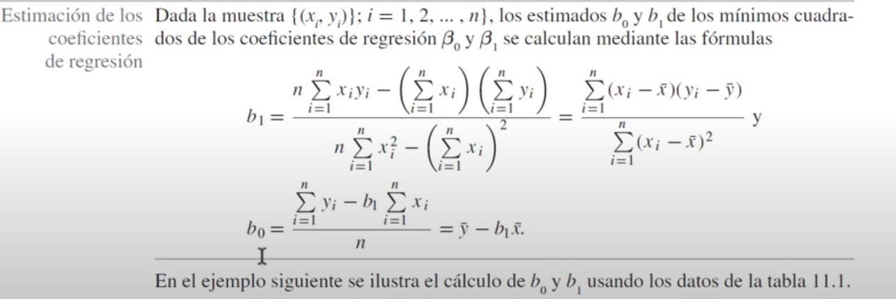

## Introdución a la regreción lineal

#### Animación de mínimos cuadrados https://www.geogebra.org/m/g5FH2ESK

#### Libro del ejemplo: Walpole, R. E., Myers, R. H., Myers, S. L., & Ye, K. (2007). Probabilidad y estadística para ingeniería y ciencias (No. TA340. P76 2007.). México: Pearson Educación.

Y= B0 + B1X1

B0 la intersección y B1 la pendiente

### Problema a resolver 

#### Necesitamos minimizar el error 

